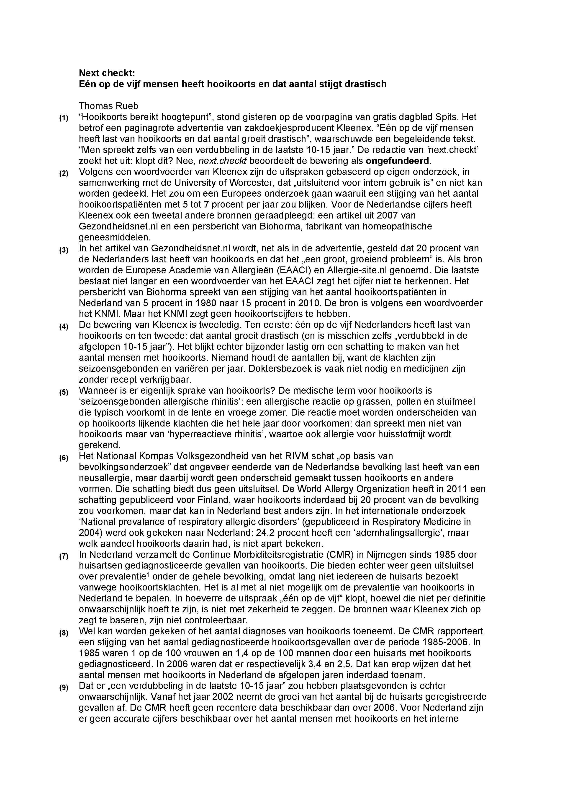
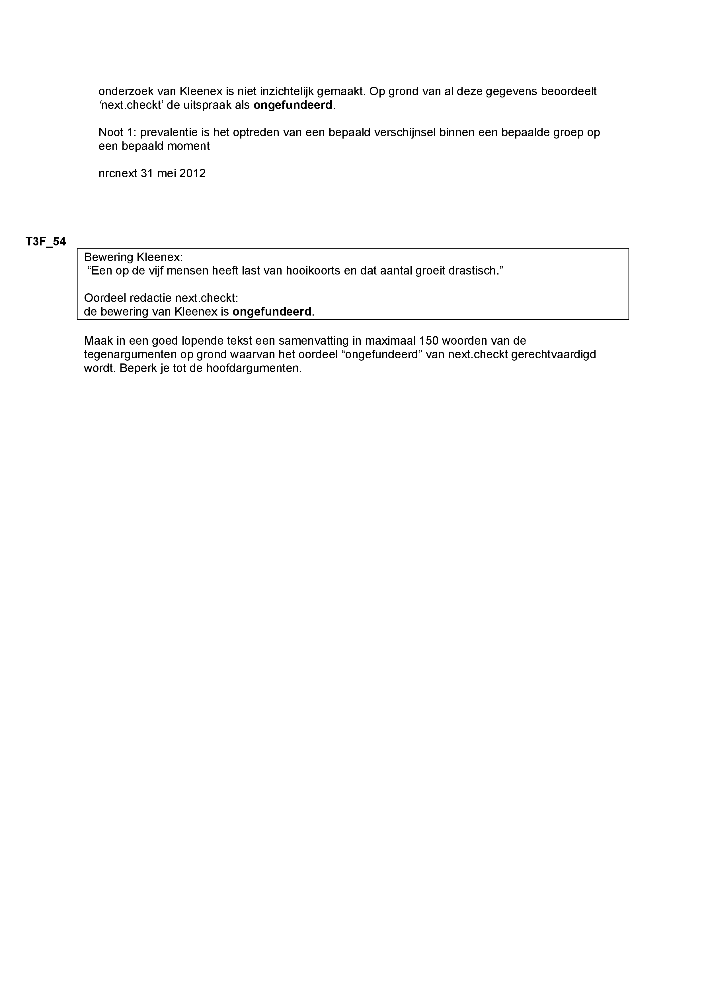
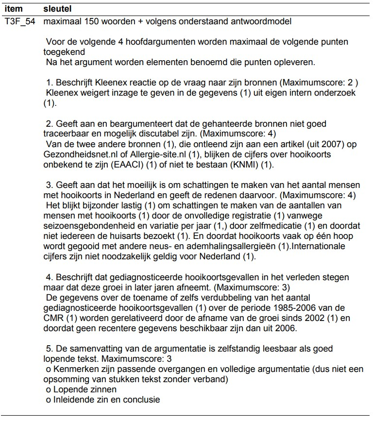

<p style= "font-size:120%"> keywords: <em> machine learning, summary writing, automatization</em></p>
<br><br><br><br><br><br>

### Introduction

<p class = "firstp"> In the secondary and tertiary educational years, most people recall the task of writing summaries. Summary writing has shown its merits in educational programs by aiding lingual development and improving overall academic achievement [@thiede2003summarizing; @gao2013effect; @marzec2016influence; @bangert2004effects]. Rating written summaries and using the ratings as a fair proxy for text quality remains a difficult task, however. Rating written text is a time-consuming procedure and subject to notable rater variability that decreases the reliability of the ratings [@eckes2008rater]. Although rubrics help reduce rater variability and rating time, the issues still linger [@harsch2013comparing: @wiseman2012comparison]. </p>

A current and maybe everlasting shortage of teachers, as well as notable rater effects, call for computerized techniques that can take over the rating procedure [@sutcher2016coming]. That is partly why much research has gone into the identification of objective text features that reflect text quality such as textual coherence and sophistication [@crossley2014does; @macarthur2019linguistic; @mcnamara2010linguistic; @mcnamara2013natural; @perin2018assessing; @halliday2014cohesion]. However, as of yet, there is no consensus which features precisely should be regarded as important and to what degree [@mcnamara2010linguistic]. 

Conventional statistical models have tried to find the importance magnitude of text features, but rely on assumptions that are in the current interest difficult to adhere to [@macarthur2019linguistic; @mcnamara2010linguistic]. This is because aforementioned models often contain a large number of features that tend to be similar to each other too [@macarthur2019linguistic; @mcnamara2014automated]. Using similar and many features introduces the issues of multicollinearity and model overfitting. Multicollinearity occurs because many similar and, as a consequence, interdependent features are used in the same statistical model. This leads to imprecise estimates of importance because this reciprocal influence makes individual relationships with the rating difficult to extract [@farrar1967multicollinearity; @alin2010multicollinearity; @james2013introduction]. Model overfitting occurs because of the large Features:Summaries ratio. This leads to the model parameter estimates being too dependent on the sample, which decreases predictive power in data points beyond the sample [@james2013introduction; @feng2017overfitting; @hawkins2004problem]. 

The Machine Learning [ML] field provides statistical techniques that are either more robust against violations of assumptions or require less assumptions in general [@james2013introduction]. Techniques such as regularization, cross-validation and ensemble methods help reduce overfitting and multicollinearity while simultaneously providing means to automate the rating of summaries [@jabbar2015methods]. 

Some research has already explored the idea of ML for text feature identification [@sladoljev2017using; @madnani2013automated; @vsnajder2019analysing]. This research however, explored only a few out of many techniques, had a relatively small sample size, and used small rating scales. This thesis intends to build on previous research by exploring multiple ML techniques and posing the framework as a regression task with a larger-scaled rating. The intention is not only to identify the importance magnitude of certain text features, but also to automatize the summary rating procedure. This thesis therefore answers the following two research questions:

<div class = "space">
1. *To what extent can ML techniques automatically rate summaries?*
2. *To what extent can ML techniques identify the importance magnitude of summary text features reflecting summary text quality?*
</div>

To answer the two posed research questions it is first explained what the data set looks like <a href = "#methods"> (1) </a>. Then, it is discussed which text features are extracted in this thesis <a href = "#UTF"> (2) </a>. Afterwards the steps undergone for pre-processing of the written summary documents are made clear <a href = "#preprocess"> (3) </a>, and finally it is discussed which ML techniques are used and on which metrics they are evaluated <a href = "#eval"> (4) </a>. <a href = "#fig1"> Figure 1</a> shows a graphical representation of the thesis.

<div id = "fig1" class = "space">
```{r GRT, echo=FALSE}
#
knitr::include_graphics("../Images/Flowchart_Thesis.jpg")
```
  <p class = "caption"><em>Figure 1.</em> Graphical Representation of the full Thesis</p>
</div>

<br><br>

<div id = "methods">
### Methodology
</div>

<p class = "firstp"> The data set contains 970 Dutch-written summaries of a passage about seasonal allergies made by Dutch secondary and tertiary educational level students. The tracks within Dutch secondary education for which data were collected were the vocational track (in Dutch: vmbo-gt), the school of higher general secondary education (havo), and the pre-university track (vwo). Data for the tertiary educational track come from post-vocational education (mbo). The summarisation exercise was part of a set of items that assess Dutch student's reading literacy. There are three of such sets available: 1F, 2F and 3F that respectively increase in difficulty [@CvTE]. The summary exercise in this thesis is of level 3F and was rated by examiners using an analytic rubric. The rubric had a large focus on gist extraction and a smaller focus on textual coherence. See <a href="#AppendixA"> Appendix A </a> for the summary exercise and <a href="#AppendixB"> Appendix B </a> for the rubric. The summary rating ranges from 0 - 16 with higher ratings reflecting higher quality summaries. Finally, the participants were instructed to write not more than 150 words. The data set is shown in <a href= "#tab1"> table 1 </a> </p>

<div id = "tab1" class = "space">
  <p class = "caption">Table 1. <em>Raw dataset</em></p>
```{r rawdata, echo = F}
library(DT)
textdocs <- read.csv2(file = "../Data/1 raw_data.csv", sep = ",")
textdocs <- textdocs[,c('text', 'schooltype', 'T3F_54')]
colnames(textdocs) <- c("text", "schooltype", "rating")

datatable(textdocs, options = list(pageLength = 1))

```
</div>

<div id = "UTF">
  <h3 class = "h3left"> Used Text Features </h3>
<div>

<p class = "firstp"> A number of text features will be calculated. Because the rubric was focused on gist extraction and textual coherence, some calculated features are either theorized or have practical support to be reflective of at least one of these dimensions [@sabatini2013preliminary; @madnani2013automated; @mcnamara2010linguistic; @pander2014t]. Other features do not necessarily reflect gist extraction or coherence, but may predict rating due to subjective differences in rater judgements, i.e. rater variability not explained by the rubric [@mcnamara2010linguistic; @kleijn2018clozing].
The features that will be calculated are: </p>

<div class = "space">
  * *Wordlength*: The number of words in a summary.
  * *Sentlength*: The number of sentences in a summary,
  * *MaxCopy*: The length of the longest common substring. The longest common substring is the length of the most consecutive words in the summary copied from the passage. 
  * *Rouge* (Recall-oriented understudy for gisting evaluation): Rouge is an algorithm developed by @lin2003automatic to automatically evaluate summaries based on n-gram co-occurrence with a model summary. A model summary in this thesis is a randomly sampled summary that got the highest rating. Rouge scores up until *Rouge3* are calculated.
</div>

*MaxCopy* and *Rouge* reflect gist extraction. *SentLength* and *WordLength* may explain rater variability not explained by the rubric. 

<div id = "preprocess">
  <h3 class = "h3left"> Data pre-processing </h3>
</div>

<p class = "firstp"> The calculation of the text features can depend on a particular processed stage of the text documents. That is why first a list is provided with general processing steps and used software. Afterwards it is explained which of the pre-processing steps are required and altered to calculate the features. The list of pre-processing steps is as follows: </p>

<div class = "space">
  <ol>
    <li>Text characters are encoded to the correct format.</li>
    <li>Punctuation is removed</li>
    <li>Redundant white spaces are removed.</li>
    <li> All words are made lowercase.</li>
  </ol>
</div>

*Rouge, MaxCopy* and *Wordlength* require all steps to be applied in the order they are presented in. For *Sentlength* the steps only need to be followed ending with step 3, where during step 2 the dots, exclamation- and question marks are retained and semicolons are replaced with dots.

Because the gist extraction features depend on exact N-gram copies of the passage or summary, stemming/lemmatization and stop-word removal are not desired. Furthermore, the output of this stage is a matrix containing the ratings and the text features of which the latter will be standardized prior to analysis. This matrix, thus not containing string values, serve as input for the ML algorithms. This means that processing steps that are typically needed for Bag-Of-Word models, such as stop word removal and stemming/lemmatization are not required. The matrix that serves as input for the ML algorithms is shown in <a href = "#tab2">table 2</a>.

<div id = "tab2" class = "space">
<p class = "caption">Table 2. <em>Input matrix for the ML algorithms</em></p>
```{r inputmatrix, echo=F}
TextFeatures <- read.csv2(file = "../Data/6 TextFeatures.csv", sep = ",", stringsAsFactors = F)[,-1]
TextFeatures <- sapply(TextFeatures, as.numeric )
datatable(round(TextFeatures,2), options = list(pageLength = 5))

```
</div>

All pre-processing and the calculation of *SentLength* will be performed in R (version 4.1.2) within Rstudio IDE (version 1.4.17.17) [@RCoreTeam; @Rstudio2021]. The other feature calculations will be performed in Python 3.9.0 within Rstudio IDE.

<div id = "eval">
<h3 class = "h3left"> ML techniques and performance metrics </h3>
<div>

<p class = "firstp"> In total, five ML techniques are used to answer the research questions. These five algorithms produce models for which variable importance can be extracted. These techniques include Ridge-, Lasso-, Elastic net-, Linear Principle Component Regression [LPCR], and Multivariate Linear Regression [MLR] of which the first three are available in package `glmnet` with function `glmnet()` and the latter two are available in the `stats` package with functions `lm()` and `prcomp()` provided by R Core Team [@glmnetJerome; @RCoreTeam]. `glmnet()` minimizes the following Residual Sum of Squares [RSS]: </p>

<div class = "space">
\begin{align}

RSS_{ElasticNet} &= \frac{1}{N} \sum_{i=1}^{N} (y_i - \beta_0+\boldsymbol{\beta}^T x_i) + \lambda\left[(1-\alpha)\|\boldsymbol{\beta}\|_2^2/2 + \alpha \|\boldsymbol{\beta}\|_1\right] \\

RSS_{Ridge} &= \frac{1}{N} \sum_{i=1}^{N} (y_i - \beta_0+\boldsymbol{\beta}^T x_i) + \lambda(\|\boldsymbol{\beta}\|_2^2/2) \\

RSS_{Lasso} &= \frac{1}{N} \sum_{i=1}^{N} (y_i - \beta_0+\boldsymbol{\beta}^T x_i) + \lambda\| \boldsymbol{\beta}\|_1

\end{align}
</div>

<p class = "firstp">with respect to $\beta_0$ and $\beta^T$  where $\alpha$ is the tuning parameter for elastic net that determines the amount of Lasso or Ridge regression. Setting $\alpha = 0$ or $\alpha = 1$ defines $RSS$ for Ridge and Lasso Respectively. </p>

These techniques were chosen because of their ability for regularization or data reduction, which reduces multicollinearity. These techniques are intended to identify the importance magnitude of text features while dealing with multicollinearity and overfitting. MLR is used as a benchmark to compare performance of the other algorithms to.

All algorithms are evaluated using 10-fold Cross-Validation [CV] with the data set first being split up in a train, and test set with respective proportions .60-.40. The hyperparameters are optimized using grid search on the validation sets. Some hyperparameters have fixed default values in their respective algorithms that will not be tuned. The hyperparameters that are varied or deviate from default are shown in <a href = "#tab3"> table 3</a>, along with their interpretation. The choice for the varying values for the hyperparameters are based on a balance between computational time and research suggested values to improve performance on high-dimensional multicollinear data [@probst2017tune; @goldstein2011random; @probst2019hyperparameters; @stathakis2009many; @obite2020multicollinearity; @farrell2019machine; @wainer2021tune]. The parameters that lead to best model performance will be used to train the models on the entire training set. The models are then tested on the test set to obtain the final metrics of evaluation. 

<div id = "tab3" class = "space">
<p class = "caption">Table 3. <em>Varying and default-deviating hyperparameters</em></p>
<div class = "caption">
| Algorithm    | Parameter    | Interpretation                    | Value                                                 |
|--------------|--------------|-----------------------------------|-------------------------------------------------------|
| Lasso/Ridge  | $\lambda$    | Amount of regularization          | default in `glmnet()`                                 |
| Elastic Net  | $\lambda$    | Amount of regularization          | default in `glmnet()`                                 |
|              | $\alpha$     | Amount of L1-L2 regularization    | 0.1-0.9                                 |
| LPCR         | $n_{pc}$     | Number of extracted PC's          | 1-4                                                  |

</div>
</div>

All algorithms are evaluated on three predictive performance metrics that determine their usability in automatically scoring summaries. Those metrics are the proportion of explained variance in the human ratings by the model: $R^2$, the Root of the Mean Squared Error: $RMSE$, and the Mean Absolute Deviation: $MAD$. The algorithms are additionally investigated on which features/principle components are selected as relevant. Relevance is in turn defined for Lasso when the algorithm selects a feature, for MLR when a regression coefficient does not contain 0 in its 95\% confidence interval, for Ridge and Elastic Net when the absolute regression coefficient > .05. Additionally, for PCR, a text feature is regarded as important if its factor loading $\geq$ .20 on at least one of the selected principle components. Both $MAD$ and $RMSE$ are used as $MAD$ is more robust against outliers. $R^2$ is used to determine how much variance in the ratings can be explained by the used text features. $RMSE$ will be the leading metric to determine predictive performance. 

All analyses will be performed in R (version 4.1.2) using Rstudio IDE (version 1.4.1717).
<br><br>

### Results

<h4> <strong>Predictive performance</strong> </h4>
<p class = "firstp"> The ability of the algorithms to correctly predict new data points was determined by looking at the $R^2$, $MAD$ and $RMSE$ values they produced. The results indicate that the MLR and Elastic Net algorithms performed best $R^2 = 0.57$, $MAD = 1.71$, $RMSE = 2.27$, closely followed by ridge regression, $R^2 = 0.56$, $MAD = 1.74$, $RMSE = 2.28$ and LPCR, $R^2 = 0.50$, $MAD = 1.89$, $RMSE = 2.42$. Lasso performed worst: $R^2 = 0.34$, $MAD = 2.29$, $RMSE = 2.8$. <a href = "#tab4"> Table 4 </a> shows the results
</p>

<div class = "space" id = "tab4">
<p class = "caption">Table 4. <em>Predictive performance of algorithms</em></p>
```{r resmetrics, echo=F}
results <- readRDS("../Results/Results.RData")

datatable(round(results$performance,2), options = list(dom = 't'))
```
</div>

<h4> <strong>Feature selection</strong> </h4>
<p class = "firstp">It was also investigated how often certain features were selected as relevant by the algorithms. <a href = "#fig2"> Figure 2 </a> shows the results.</p>

<div class = "space" id = "fig2">
<p class = "caption"><em>Figure 2.</em> Feature importance</p>
```{r featureimportance, echo=F}
featimp <- sort(results$feature_imp, decreasing = T)
plot(featimp, type = "b", main = "Number of times feature is selected", xlab = "Features", ylab = "Counts")
```
</div>


<br><br>
<div class = "space">
References
==================
<div id="refs"></div>
</div>
<br><br>

<div id = "AppendixA" class = "space">
Appendix A
==================
<br>
```{r exercise, echo=FALSE}
#



```
</div>
<br><br>

<div id = "AppendixB" class = "space">
Appendix B
==================
<br><br>
```{r rurbic, echo=FALSE}

```
</div>


