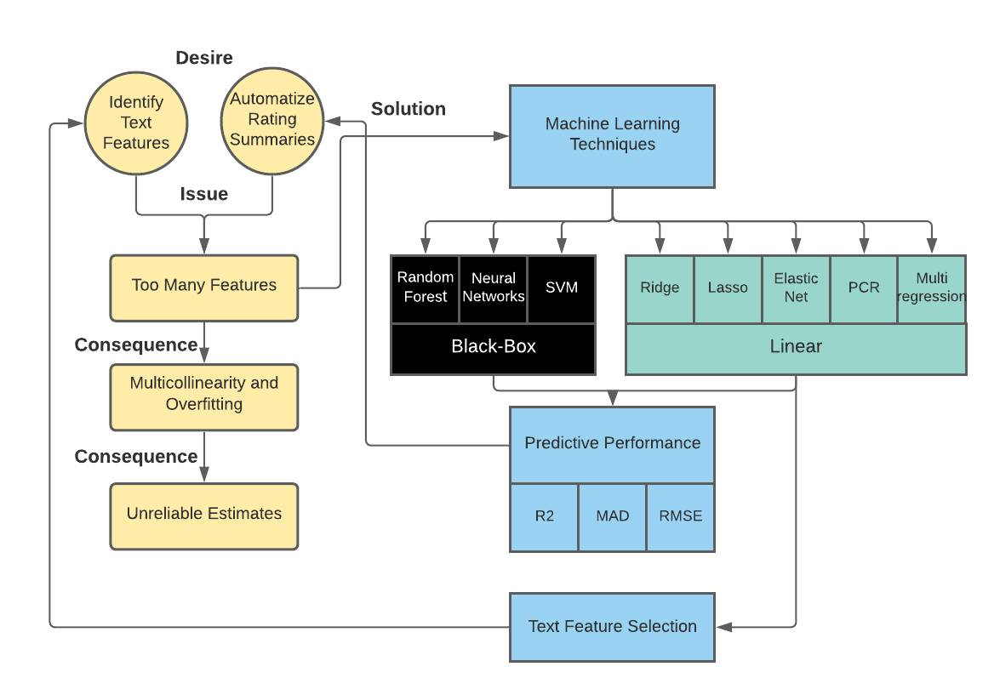

Abstract
==================

Input abstract here

\newpage


Introduction
==================
In the secondary and tertiary educational years, most people recall the task of writing summaries. Summary writing has shown its merits in educational programs by aiding lingual development and improving overall academic achievement [@thiede2003summarizing; @gao2013effect; @marzec2016influence; @bangert2004effects]. Rating written summaries and using the ratings as a fair proxy for text quality remains a difficult task, however. Rating written text is a time-consuming procedure and subject to notable rater variability that decreases the reliability of the ratings [@eckes2008rater]. Although rubrics help reduce rater variability and rating time, the issues still linger [@harsch2013comparing: @wiseman2012comparison].

A current and maybe everlasting shortage of teachers, as well as notable rater effects, call for computerized techniques that can take over the rating procedure [@sutcher2016coming]. That is partly why much research has gone into the identification of objective text features that reflect text quality such as textual coherence and sophistication [@crossley2014does; @macarthur2019linguistic; @mcnamara2010linguistic; @mcnamara2013natural; @perin2018assessing; @halliday2014cohesion]. However, as of yet, there is no consensus which features precisely should be regarded as important and to what degree [@mcnamara2010linguistic]. 

Conventional statistical models have tried to find the importance magnitude of text features, but rely on assumptions that are in the current interest difficult to adhere to [@macarthur2019linguistic; @mcnamara2010linguistic]. This is because aforementioned models often contain a large number of features that tend to be similar to each other too [@macarthur2019linguistic; @mcnamara2014automated]. Using similar and many features introduces the issues of multicollinearity and model overfitting. Multicollinearity occurs because many similar and, as a consequence, interdependent features are used in the same statistical model. This leads to imprecise estimates of importance because this reciprocal influence makes individual relationships with the rating difficult to extract [@farrar1967multicollinearity; @alin2010multicollinearity; @james2013introduction]. Model overfitting occurs because of the large `Features:Summaries` ratio. This leads to the model parameter estimates being too dependent on the sample, which decreases predictive power in data points beyond the sample [@james2013introduction; @feng2017overfitting; @hawkins2004problem]. 

The Machine Learning [ML] field provides statistical techniques that are either more robust against violations of assumptions or require less assumptions in general [@james2013introduction]. Techniques such as regularization, cross-validation and ensemble methods help reduce overfitting and multicollinearity while simultaneously providing means to automate the rating of summaries [@jabbar2015methods]. 

Some research has already explored the idea of ML for text feature identification [@sladoljev2017using; @madnani2013automated; @vsnajder2019analysing]. This research however, explored only a few out of many techniques, had a relatively small sample size, and used small rating scales. This thesis intends to build on previous research by exploring multiple ML techniques and posing the framework as a regression task with a larger-scaled rating. The intention is not only to identify the importance magnitude of certain text features, but also to automatize the summary rating procedure. This thesis therefore answers the following two research questions:

1. *To what extent can ML techniques automatically rate summaries?*
2. *To what extent can ML techniques identify the importance magnitude of summary text features reflecting summary text quality?*

To answer the two posed research questions it is first explained what the data set looks like *ref methods*. Then, it is discussed which text features are extracted in this thesis *ref methods*. Afterwards the steps undergone for pre-processing of the written summary documents are made clear *ref methods*, and finally it is discussed which ML techniques are used and on which metrics they are evaluated *ref methods*. Figure \ref{fig:GRT} shows a graphical representation of the thesis.


```{r GRT, echo=FALSE, fig.cap= "\\label{fig:GRT} *Graphic Representation of the Thesis*"}
#

```


Methodology
==================

input Methods

```{r hyperparams, echo=FALSE}
header <- c('Algorithm', 'param', 'interpretation', 'values')
midrule <- as.data.frame(cbind(c("lasso/Ridge", 'Elastic Net', '', 'PCR', '', "RandomForest", '', '', 'Neural Net', '', 'SVR', ''),
                 rep('a', 12),
                 rep('b', 12),
                 rep('b', 12)))
colnames(midrule) <- header
data.table::data.table(midrule, options = list(pageLength = 12))

                 


```


Results
==================

input Results

Discussion
==================

input discussion

\newpage

References
==================
<div id="refs"></div>